[TOC]

# ImgProcess_in_C

用纯 C 语言完成的一套图像处理流程。包括 bmp 的文件 IO、RGB 数据的处理、图像直方图均衡、图像灰度线性拉伸、图像傅里叶变换、快速傅里叶（逆）变换、余弦（逆）变换，在图像压缩方面还可以进行 bmp 到jpeg的有损转换等，后续可能有更多功能加入。


## 功能介绍

### 1 读取 BMP 图像

用 C 语言读取 BMP 图像难度不大，整体要搞定这种文件的文件头，以及信息头、调色板等内容。暂时完成了 24bit 与 8bit 的读取、互转与存取。


主要的结构可以查看以下定义的结构体：

```c
typedef struct bmpFileHeader {
    unsigned short bFType;        // File type (0x4d42 19778)
    unsigned short bFSize_1;      // File size in bytes _1 (2-3 Bytes)
    unsigned short bFSize_2;      // File size in bytes _2 (4-5 Bytes)
    unsigned short bFReserved1;   // Reserved (6-7 Bytes)
    unsigned short bFReserved2;   // Reserved (8-9 Bytes)
    unsigned short bFOffBits_1;   // Offset to image data _1  (10-11 Bytes)
    unsigned short bFOffBits_2;   // Offset to image data _2  (12-13 Bytes)
    unsigned int bFSize;          // File size
    unsigned int bFOffBits;       // Offset to image data
} bmpFileHeader;

typedef struct bmpInfoHeader {
    unsigned int bISize;          // Info header size (14-17 Bytes)
    int bIWidth;                  // Width  (18-21 Bytes)
    int bIHeight;                 // Height  (22-25 Bytes)
    unsigned short bIPlanes;      // Number of colour planes (26-27 Bytes)
    unsigned short bIBitCount;    // Bits per pixel (28-29 Bytes)
    unsigned int bICompression;   // Compression type (30-33 Bytes)
    unsigned int bISizeImage;     // Image size (34-37 Bytes)
    int bIXPelsPerMeter;          // XPixels per meter (38-41 Bytes)
    int bIYPelsPerMeter;          // YPixels per meter (42-45 Bytes)
    unsigned int bIClrUsed;       // Number of colours (46-49 Bytes)
    unsigned int bIClrImportant;  // Important colours (50-53 Bytes)
} bmpInfoHeader;

typedef struct bmpPixelInfo {
    unsigned char rgbBlue;        // B  (0-255)
    unsigned char rgbGreen;       // G  (0-255)
    unsigned char rgbRed;         // R  (0-255)
    unsigned char rgbReserved;    // Reserved
} bmpPixelInfo;
```

由于 C 语言的 struct 结构体大小计算的限制，`bFSize` 与 `bFOffBits`被我拆开成了 2 个部分，并使用位运算合成的方式，这样可以减少文件 IO 函数使用的时间，做到一定的优化。

这里要注意一个问题，就是 BMP 文件读取的时候，由于格式要求 32 位完整大小，所以遇到 `图像宽度*位宽` 非 32 的倍数时，要在该行末尾补 0，直到其数据长度被 32 整除。


<div align = "center">lena 24bit origin</div>


另外，由于 24-bit 的真彩 BMP 文件不会有调色板的问题，因此在 24bit 转换到 8bit 图像的时候需要加入调色板的信息，我这里直接加入了全灰度色板 (0-255)，如有需要可以选择更改 `bmpFileIO/bmpBoard.profile`，注意要用二进制打开该文件。

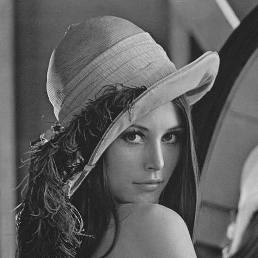

<div align = "center">lena 24bit gray</div>


<div align = "center">lena 8bit gray</div>


### 2 直方图均衡

图像直方图均衡，对于背景和前景都太亮或者太暗的图像非常有用，这种方法可以带来灰度图图像中曝光过度或者曝光不足照片中更好的细节。这种方法的一个缺点是它对处理的数据不加选择，它可能会增加背景噪声的对比度并且降低有用信号的对比度。

累积分布函数 cdf，定义为： $cdf(v) = \Sigma_i cdf(i), i < v$ .

新的映射 h(v)，定义为： $h(v) = round(\frac{cdf(v)-cdf_{min}}{cdf_{max}-cdf_{min}})*(L-1)$ .


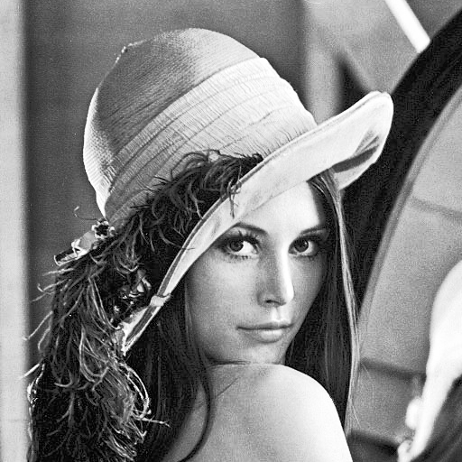

<div align = "center">lena 8bit HistogramEqualization</div>

此外，该方法不适合应用于 RGB 图像，因为 RGB 图像的三个维度数据之间有联系，直接分别对 r、g、b 三个通道直接进行直方图均衡，会导致颜色的失真。


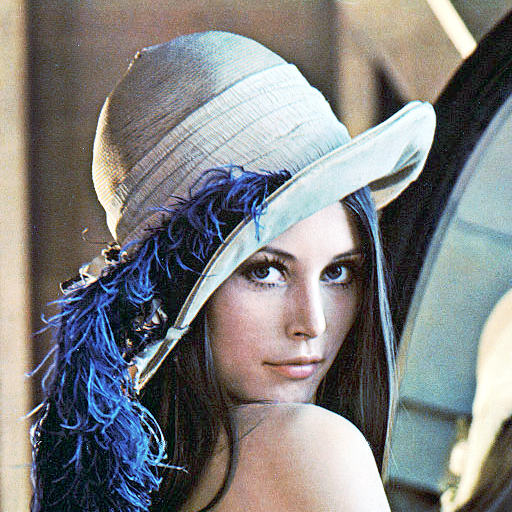

<div align = "center">lena 24bit HistogramEqualization</div>


### 3 线性变换

图像的线性变换，要求为有一个分段函数建立在各个通道上，并将原先的通道值通过新的函数映射成新的。这里做了一个简化，程序可以接收一个序列包含在中括号 `[]` 内，序列的内容为分段函数的拐点，一次最多可以接受 20 个拐点（必须包含 0 和 255的点，且需要从小到大排列）。


例如输入序列：`[[0,0],[100,40],[150, 100],[200,250],[255,255]]` 

则可以得到如下灰度图结果：

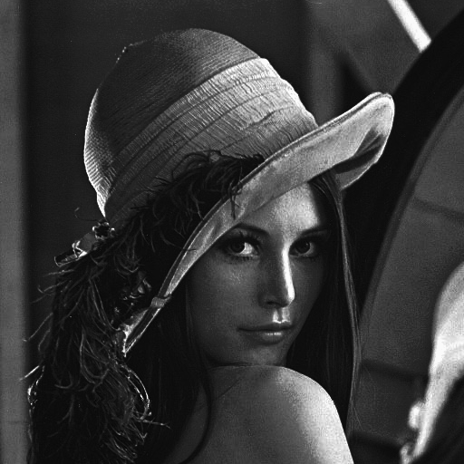

<div align = "center">lena 8bit LineaTransform</div>

当然，也可以得到如下真彩图结果：


<div align = "center">lena 24bit LineaTransform</div>


### 4 傅里叶变换

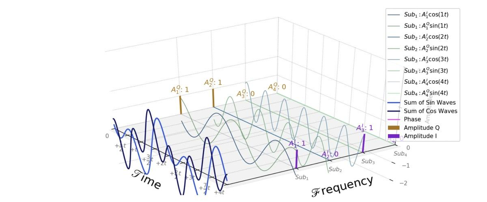


<div align = "center">图示原理</div>

关于傅里叶变换，这是一张比较经典的图了，从时域频域拆解信号。


搞明白 FFT，**首先要搞明白 DFT**。这段课件中有详细的阐述，在这里只给出一个 DFT 的公式，其中的 $X_k$ 、 $x_n$ 为一列复数序列：


直接通过公式求解，需要暴力的进行 $O(N^2)$ 时间复杂度得到变换后的结果，这是无法接受的，尤其是面对响应速度极快的应用场景时是一个灾难。那我们就需要 FFT 进行加速，把时间复杂度压下来。


我在底层函数中完成的是基于 Cooley–Tukey 的 FFT 算法，其因中文名形象地称为蝶形算法而著名。我们用 $N$ 次单位根 ${W_{N}}$ 来表示 ${e^{-j{\frac {2\pi }{N}}}}$。

${W_{N}}$ 的性质：

1. 周期性，${W_{N}}$ 具有周期 ${N}$，即 ${W_{N}^{k+N}=W_{N}^{k}}$ 

2. 对称性：${W_{N}^{k+{\frac {N}{2}}}=-W_{N}^{k}}$。

3. 若 ${m}$ 是 ${N}$ 的约数，${W_{N}^{mkn}=W_{\frac {N}{m}}^{kn}}$ 。

为了简单起见，我们下面设待变换序列长度 ${n=2^{r}}$。根据上面单位根的对称性，求级数 ${y_{k}=\sum _{n=0}^{N-1} W_{N}^{kn}x_{n}}$ 时，可以将求和区间分为两部分：

${{\begin{matrix}y_{k}=\sum _{n=2t}W_{N}^{kn}x_{n}+\sum _{n=2t+1}W_{N}^{kn}x_{n}\\=\sum _{t}W_{\frac {N}{2}}^{kt}x_{2t}+W_{N}^{k}\sum _{t}W_{\frac {N}{2}}^{kt}x_{2t+1}\\=F_{even}(k)+W_{N}^{k}F_{odd}(k)&&&&&&(i\in \mathbb {Z} )\end{matrix}}}$

${F_{odd}(k)}$ 和 ${F_{even}(k)}$是两个分别关于序列 ${\left\{x_{n}\right\}_{0}^{N-1}}$ 奇数号和偶数号序列 $N/2$ 点变换。由此式只能计算出 ${y_{k}}$ 的前 $N/2$ 个点，对于后 $N/2$ 个点，注意 ${F_{odd}(k)}$ 和 ${F_{even}(k)}$ 都是周期为 $N/2$ 的函数，由单位根的对称性，于是有以下变换公式：

${y_{k+{\frac {N}{2}}}=F_{even}(k)-W_{N}^{k}F_{odd}(k)}$

${y_{k}=F_{even}(k)+W_{N}^{k}F_{odd}(k)}$


这样，一个 $N$ 点变换就分解成了两个 $N/2$ 点变换。这是一个基本的分治算法，照这样可继续分解下去。根据算法分析原理中的 **主定理扩展原则** 不难分析出此时算法的时间复杂度符合 ${\mathrm {O} (N\log N)}$ 复杂度的判定。

上述的算法原理，适用于所有的离散信号采样序列。对于一个二维离散信号，需要进行转换。从一维得到二维其实不难，更高维度也是一样，每一个维度做一次 FFT 即可完成多维度的信号处理。对于二维图像，先对输入的图像 $m * n$ 的第一个维度先做一维 **fft**，把结果存到一个 $m*n$ 的矩阵中，再对矩阵的另一个维度做一次 fft。这时得到的结果就是二维图像 $m * n$ 的快速傅里叶变换的输出，大小为 $height * width * depth$。


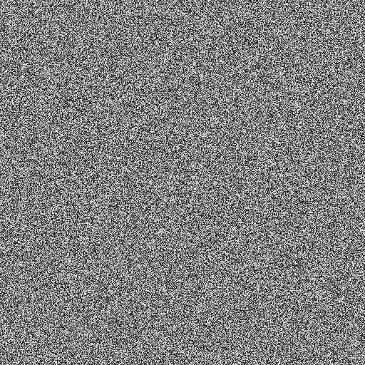

<div align = "center">零相位时的快速傅里叶变换输出</div>


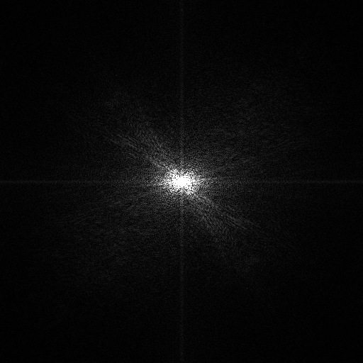

<div align = "center">FFT后高频居中的频域图像输出</div>


<div align = "center">FFT变换后直接逆变换输出</div>


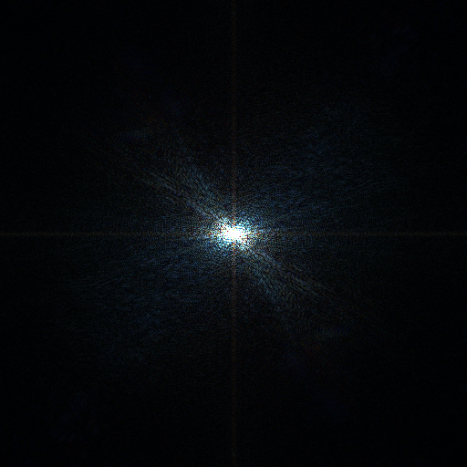

<div align = "center">对RGB三个通道均进行FFT后高频居中叠加显示</div>


### 5 余弦变换

全称为离散余弦变换 (DCT)。DCT 变换本身是无损的，但是在图像编码等领域给接下来的量化、哈弗曼编码等创造了很好的条件，同时，由于DCT变换是对称的，所以，我们可以在量化编码后利用DCT反变换，在接收端恢复原始的图像信息。

可见以下公式：

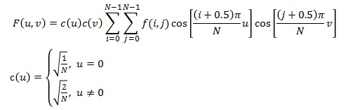


二维余弦变换的公式，由于推导过程写起来比较复杂，可以参见以下的公式：


我实现的 DCT 没有经过蝶形算法优化，时间复杂度为 $O(N^2)$，可以参考相关资料进行更细致的优化。


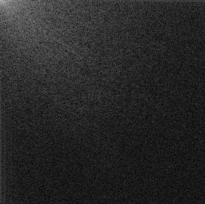

<div align = "center">余弦变换输出显示</div>


### 6 JPEG 压缩算法

**JPEG算法的第 1 步，图像被分割成大小为 8X8 的小块。**这些小块在整个压缩过程中都是单独被处理，这一步比较简单，将输入的彩色图片分块存储即可。实际代码编写的时候，是处理到某一块的时候才会将其分离出来进行处理。

**第 2 步，就需要将原本颜色空间 RGB 转换到 YCbCr 色彩空间。**这一步骤已经在程序实现的 API 中写到过，就是对 RGB 矩阵数据的线性变换，此处不再赘述。（YCbCr 色彩模型广泛应用在图片和视频的压缩传输中，用在 jpeg 压缩中也是很显然的）

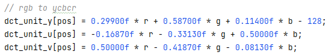

 

**第 3 步就是 DCT 变换，对每一个块的 YCbCr 三个矩阵做一个 DCT 变换。**对每一个 YCbCr 色彩块的三个矩阵做 DCT 变换，变换后的数据左上角为低频部分，右下角为高频部分。（可以参考文档上部的参考图）


**第 4 步就是数据量化，即量子化。**这个步骤看着很云里雾里，其实就是损失精度进行量化，JPEG 有定义量子化算法：

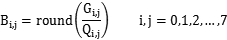

量化矩阵与前面得到的 DCT 矩阵逐项相除并进行四舍五入得到量化后矩阵， 其中G是我们需要处理的图像矩阵，Q称作量化系数矩阵（Quantization matrices），量化矩阵是由预先设置的图像质量分数进行生成的，直流分量相对于交流分量来说基本要大很多，而且交流分量中基本会有大量的 0。

JPEG 算法提供了两张标准的量化系数矩阵，分别用于处理亮度数据 Y 和色差数据 Cr、Cb ：

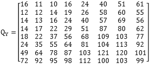

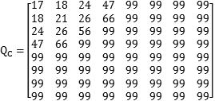

第 4 步的末尾还有一步就是要将数据从二维转换到一维，以方便后面的霍夫曼压缩。这个步骤就是 Zigzag 扫描，用一个折返方向进行数据排列，这一步大部分情况下可以获得一个尾部大多数为 0 的一块数据。


**最后第 5 步，进行一维数组的霍夫曼压缩编码。**采用 JPEG 推荐的亮度、色度，直流、交流的霍夫曼编码表，一共四张。这一步比较简单，之前大一的时候我也写过相关的代码，所以直接进行一波优化加入算法中即可。


<div align = "center">质量分数为 100 的 lena 图像输出</div>


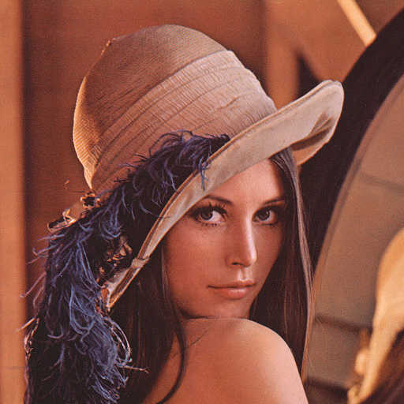

<div align = "center">质量分数为 50 的 lena 图像输出</div>


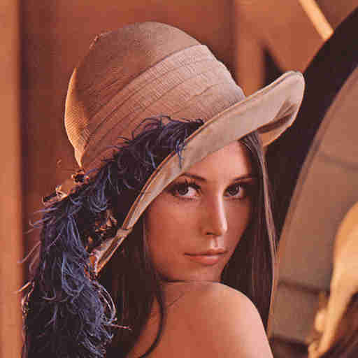

<div align = "center">质量分数为 20 的 lena 图像输出</div>


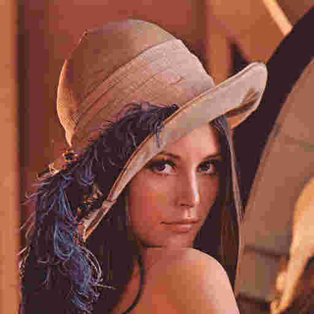

<div align = "center">质量分数为 10 的 lena 图像输出</div>


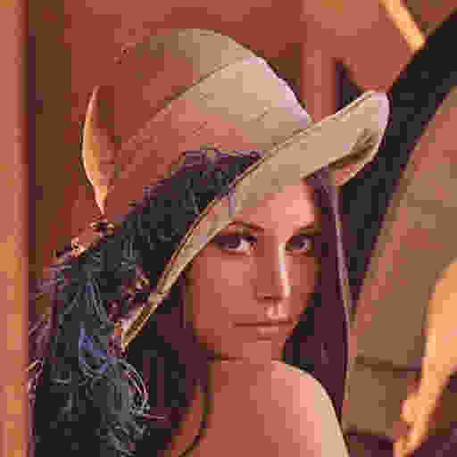

<div align = "center">质量分数为 5 的 lena 图像输出</div>


下面是程序实现的照片与 Windows 画图同时对 Lena 的 bmp 格式照片进行转换的情况，两个文件大小基本相同 (约为102kb) 的情况下对比对应的 RGB 数据。

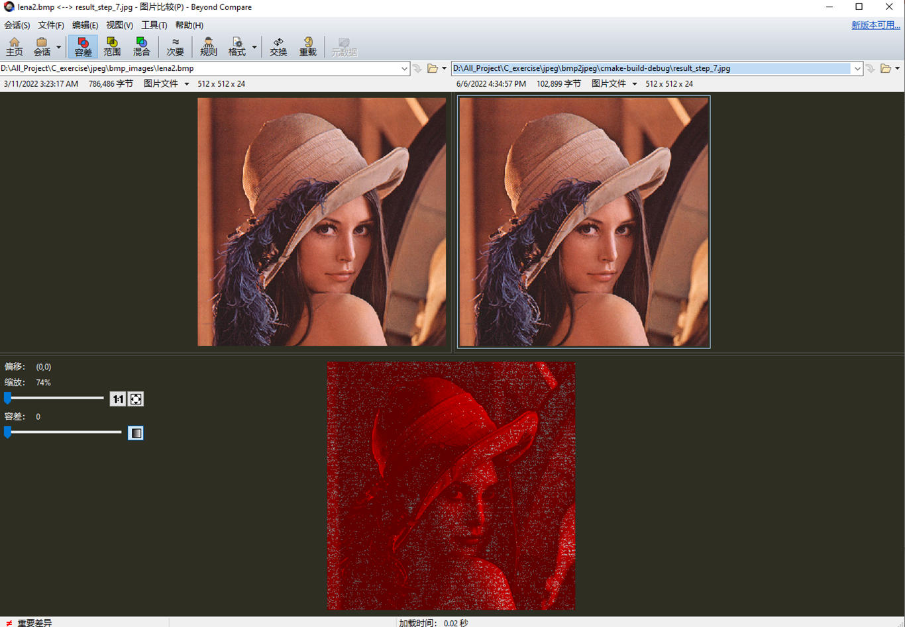

<div align = "center">程序实现的 jpeg 压缩的输出，质量数为 90</div>


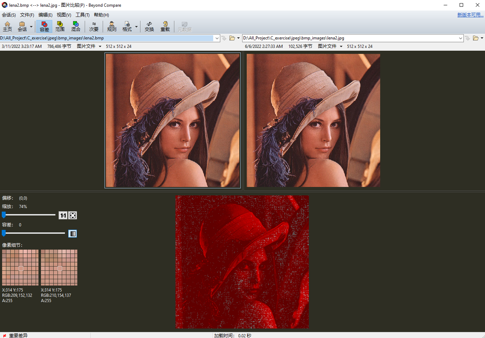

<div align = "center">Windwows 编辑器 jpeg 有损转换，测试得到质量数为 90</div>

程序实现的 jpeg 图像效果要 **优于 Windows 画图软件的格式转换**。用户可以程序尝试一下进行对比，可得我的转换不会过多的丢失低频信号，而其他很多的软件低频信号丢失相对严重，所以本项目的 jpeg 压缩效果较好。

*关于质量数：这是一个控制 jpeg 压缩比例的百分数，采用分段函数实现：当该分数小于50的时候由于希望生成的量化表获得足够大的数，这时采用反比例函数；当该分数大于50时，采用一条直线直接进行映射。这个质量数不是唯一的，大家可以根据自己的需要进行修改。*


本项目每次进行一次 $512*512*24bit$ 大小的 BMP 图像转换到 jpeg 图象时，耗时大约在 15-20ms，即可大约完成一秒钟 60 帧的压缩（纯照片压缩，非视频 H.264）。


## 项目结构

`settings/` 存储图像的信息头，颜色板，各种参数信息，不建议更改。

`processAPI/` 封装的 API 函数，可以根据 `base/` 目录下的任意底层函数进行调用，可以自行更改。

`FileIO/` bmp 24bit 8bit 图像的互转（包括颜色板）、输入输出等，不建议更改。后面会加入 jpeg 图片格式的相关函数。

`base/` 图像底层的函数，`base/transferFunc.h` 为颜色空间转换底层函数，`base/algoFunc.h` 为各种图像处理算法的底层函数，`base/tf.h` 为离散余弦（逆）变换、离散傅里叶（逆）变换等底层函数，`base/data.h` 为数据转换专用的一组头文件。

`jpgTransfer/` 是还未整理的 jpeg 压缩函数，是单独的一种测试方式，稍后会整合到整体的 API 中。

`example/` 为各种调试图片输出，可根据命名查看处理后的结果。


当开始测试的时候，注意在 `main.c` 的算法区域填入自己封装的 API，用来测试相关的性能和正确性。


## Run

Compile the C file:

```bash
cmake ./CMakeLists.txt
make
```


Then run with args[ ], filled with filename:

```bash
./ImgProcess_in_C example/lena2.bmp [options]
```


该工具没有做相关的命令行运行工具，用户需要自行在算法加注区域自行填入相关的操作函数。

**该项目所有功能已经在 Linux/Windows 通过验证**